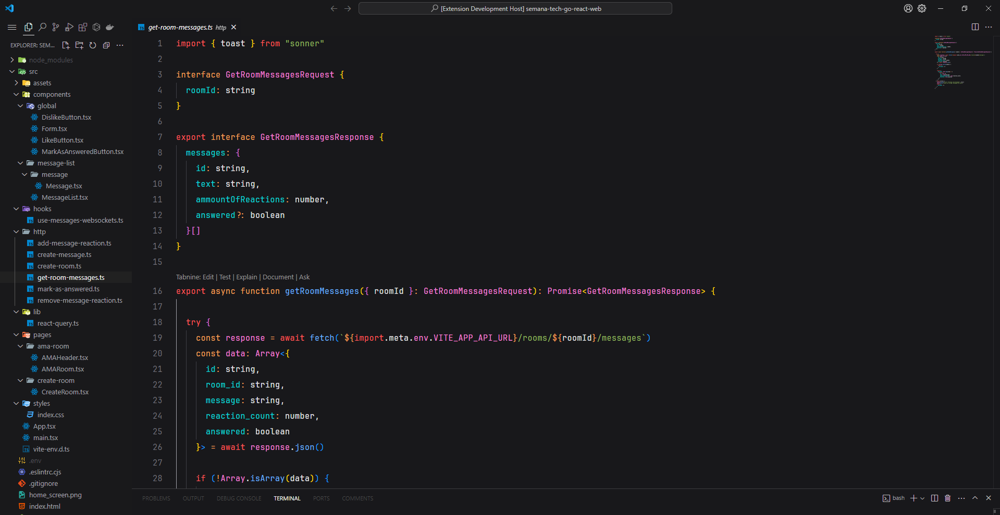

# rmv-min-theme README

## A VSCode Theme inspired by JetBrain's IDE Intellij IDEA

CurrentVer: _1.0.6_

## Description

* Dark Themes are eye-friendly, and I wanted to create a theme that was somehow similar to other IDE, having a pleasant syntax highlighting that is easy to differentiate when searching through your code. 

Use it with font JetBrains Mono for better immersion

**Enjoy!**
