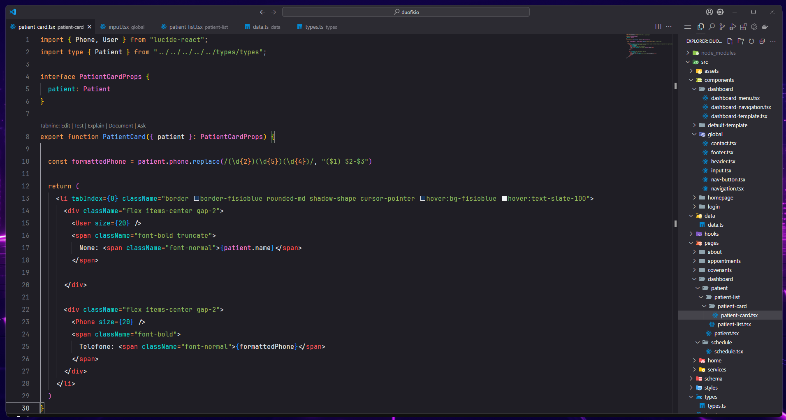
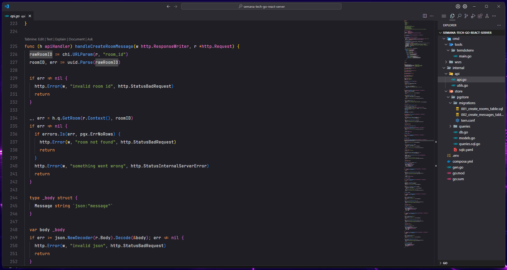
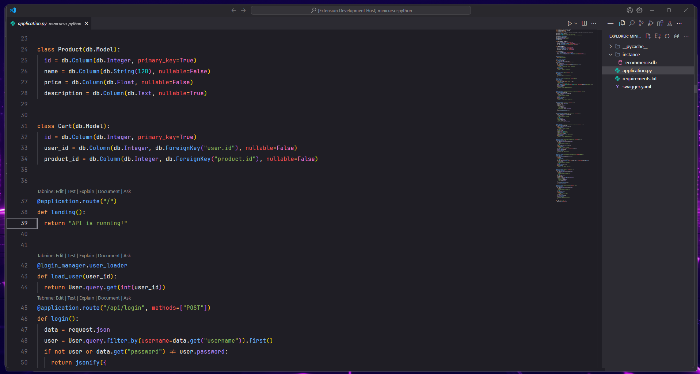

# Brainstorm README

## A VSCode Theme drawing inspiration of JetBrains IDE for Java/Kotlin: Intellij IDEA

CurrentVer: _1.0.10_

## Description

* Dark Themes are eye-friendly, and I wanted to create a theme that was somehow similar to their IDE, having a pleasant syntax highlighting that is easy to differentiate when searching through your code. 

Use it with font JetBrains Mono for better immersion

### Typescript/HTML

#
### GoLang

#
### Python

#

### Requests can be made at GitHub

**Enjoy!**